<div align="center">

<picture>
  <source media="(prefers-color-scheme: dark)" srcset="./docs/screenshots/home-dark.png">
  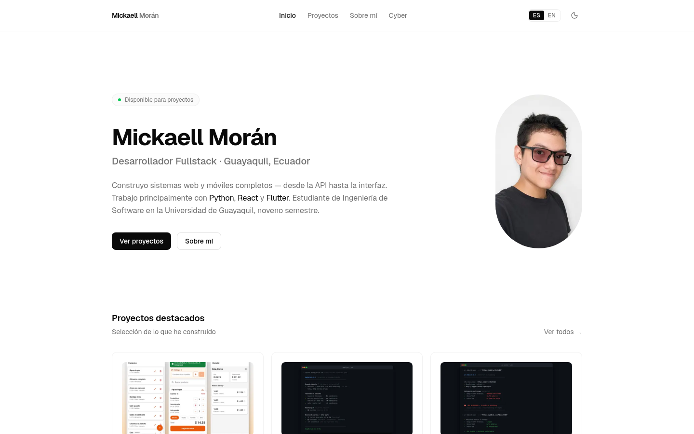
</picture>

<br/><br/>

<picture>
  <source media="(prefers-color-scheme: dark)" srcset="./docs/screenshots/title-dark.svg">
  
</picture>

### Portafolio personal y CV dinámico, bilingüe ES/EN

**12 proyectos documentados como case studies en MDX**<br/>
**CV en PDF formato Harvard, uno por idioma**<br/>
**100 % estático: sin backend, sin base de datos**

<br/>

<a href="https://mickaell.novamicktools.com"></a>

[](#idiomas)
[](#el-cv-en-pdf)
[](#proyectos)
[](#vista-previa)
[](#características)

[](https://nextjs.org)
[](https://react.dev)
[](https://www.typescriptlang.org)
[](https://tailwindcss.com)
[](https://ui.shadcn.com)
[](#deploy)
[](#deploy)

[](https://www.linkedin.com/in/mickaell-moran-vera-ba421a2a3/)
[](https://github.com/Mickaell22)
[](https://www.youtube.com/@mickaell1335)
[](mailto:mickaelmoranvera03@gmail.com)

<br/>

[**Ver en vivo**](https://mickaell.novamicktools.com) •
[Vista previa](#vista-previa) •
[Proyectos](#proyectos) •
[Características](#características) •
[Stack](#stack) •
[Desarrollo local](#desarrollo-local)

[El CV en PDF](#el-cv-en-pdf) •
[Idiomas](#idiomas) •
[Estructura](#estructura) •
[Deploy](#deploy) •
[Roadmap](#roadmap)

</div>

---

## Sobre el proyecto

Portafolio personal de **Mickaell Morán**, desarrollador fullstack freelance y estudiante de Ingeniería de Software en la Universidad de Guayaquil (noveno semestre). Trabajo principalmente con **Python**, **React** y **Flutter**.

El sitio está hecho con Next.js App Router. El contenido vive en MDX versionado en git, todo está en español e inglés y el CV se descarga en PDF en cada idioma. No hay backend ni base de datos: se prerenderiza y se sirve estático.

| Área | Estado |
| --- | --- |
| Fullstack | Principal |
| Ciberseguridad | En formación (Google Cybersecurity Certificate) |
| UX Design | En formación (Google UX Design Certificate) |

---

## Vista previa

<table>
  <tr>
    <td align="center" width="33%">
      <picture>
        <source media="(prefers-color-scheme: dark)" srcset="./docs/screenshots/projects-dark.png">
        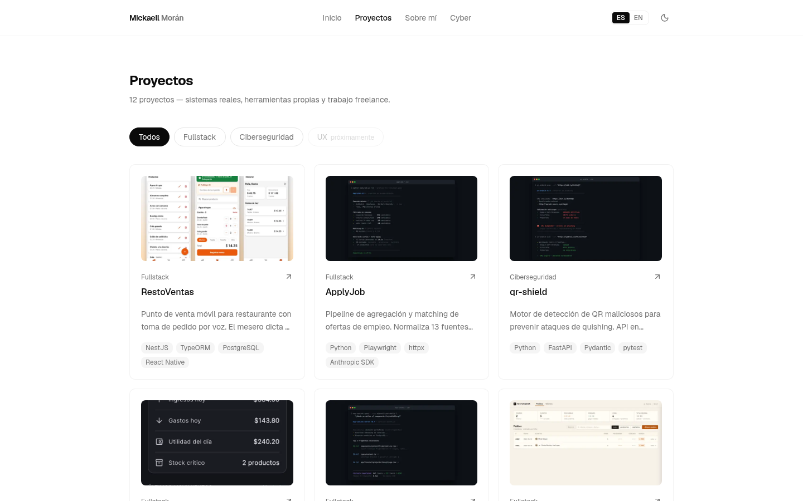
      </picture>
      <br/><sub><b>Proyectos</b> con filtros por área</sub>
    </td>
    <td align="center" width="33%">
      <picture>
        <source media="(prefers-color-scheme: dark)" srcset="./docs/screenshots/about-dark.png">
        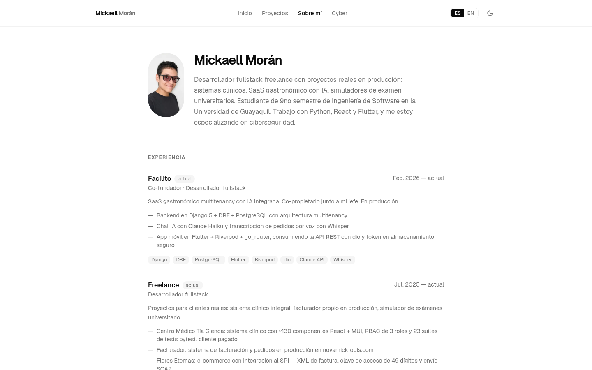
      </picture>
      <br/><sub><b>Sobre mí</b>: experiencia, educación y skills</sub>
    </td>
    <td align="center" width="33%">
      <picture>
        <source media="(prefers-color-scheme: dark)" srcset="./docs/screenshots/cv-dark.png">
        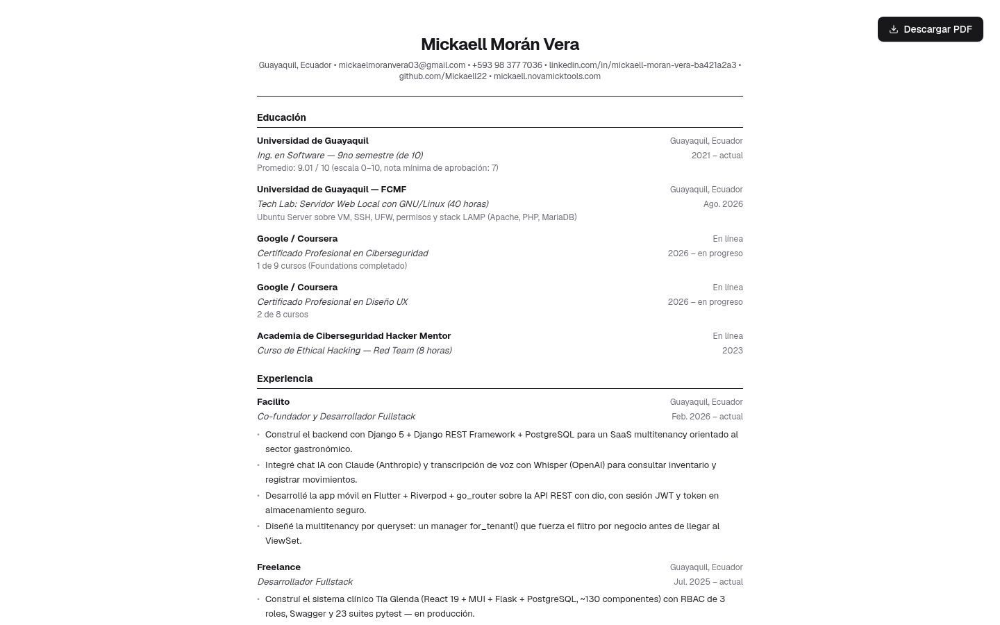
      </picture>
      <br/><sub><b>CV</b> en pantalla + descarga en PDF</sub>
    </td>
  </tr>
</table>

<details>
<summary><b>Versión móvil</b></summary>
<br/>
<div align="center">
  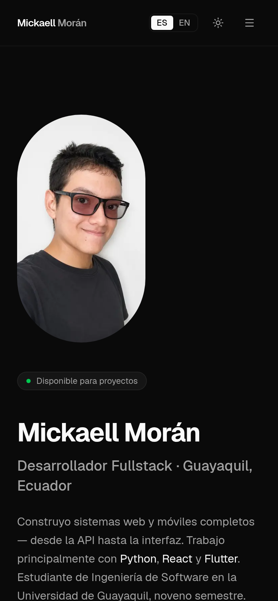
</div>
</details>

---

## Proyectos

Cada proyecto es un case study en MDX (`content/projects/{es,en}/`) con stack, rol, galería y enlace al repo. Estos son algunos:

<table>
  <tr>
    <td align="center" width="33%">
      <a href="https://mickaell.novamicktools.com/proyectos/restoventas">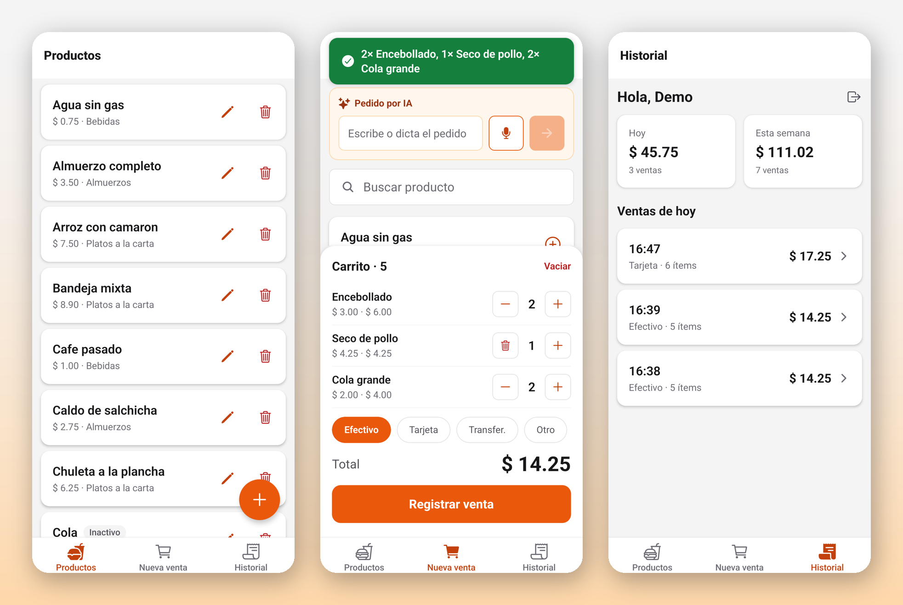</a>
      <br/><b>RestoVentas</b>
      <br/><sub>POS móvil con pedido por voz. El LLM arma el carrito y el backend lo valida contra el catálogo real.</sub>
      <br/><sub><code>NestJS</code> <code>PostgreSQL</code> <code>React Native</code></sub>
    </td>
    <td align="center" width="33%">
      <a href="https://mickaell.novamicktools.com/proyectos/apply-job">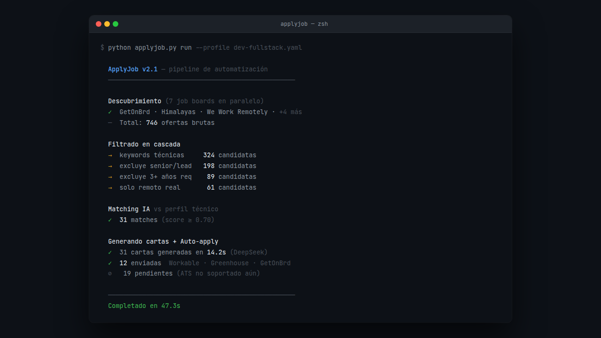</a>
      <br/><b>ApplyJob</b>
      <br/><sub>Pipeline que normaliza ofertas de 13 fuentes, las puntúa contra el perfil y genera cartas con un LLM.</sub>
      <br/><sub><code>Python</code> <code>Playwright</code> <code>Anthropic SDK</code></sub>
    </td>
    <td align="center" width="33%">
      <a href="https://mickaell.novamicktools.com/proyectos/qr-shield">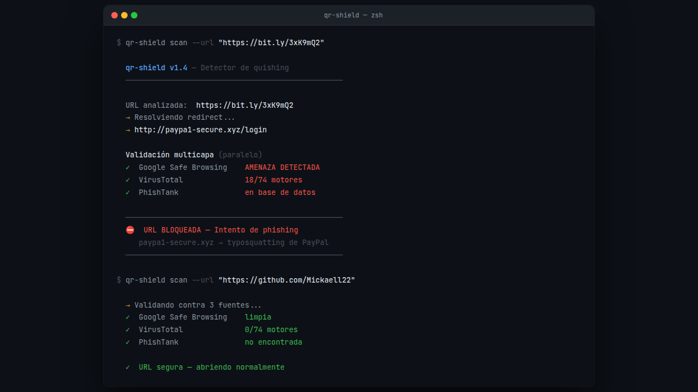</a>
      <br/><b>qr-shield</b>
      <br/><sub>Motor anti-quishing: puntúa URLs de QR con heurísticas estáticas antes de abrirlas.</sub>
      <br/><sub><code>Python</code> <code>FastAPI</code> <code>pytest</code></sub>
    </td>
  </tr>
  <tr>
    <td align="center" width="33%">
      <a href="https://mickaell.novamicktools.com/proyectos/centro-tia-glenda">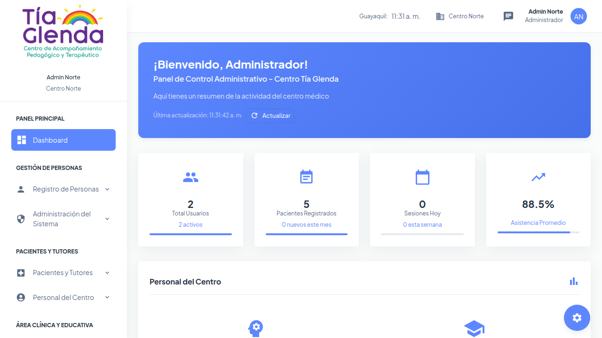</a>
      <br/><b>Centro Tía Glenda</b>
      <br/><sub>Gestión clínica para un centro de terapia: pacientes, personal, reportes PDF y chat interno.</sub>
      <br/><sub><code>React</code> <code>Flask</code> <code>PostgreSQL</code></sub>
    </td>
    <td align="center" width="33%">
      <a href="https://mickaell.novamicktools.com/proyectos/flores-eternas">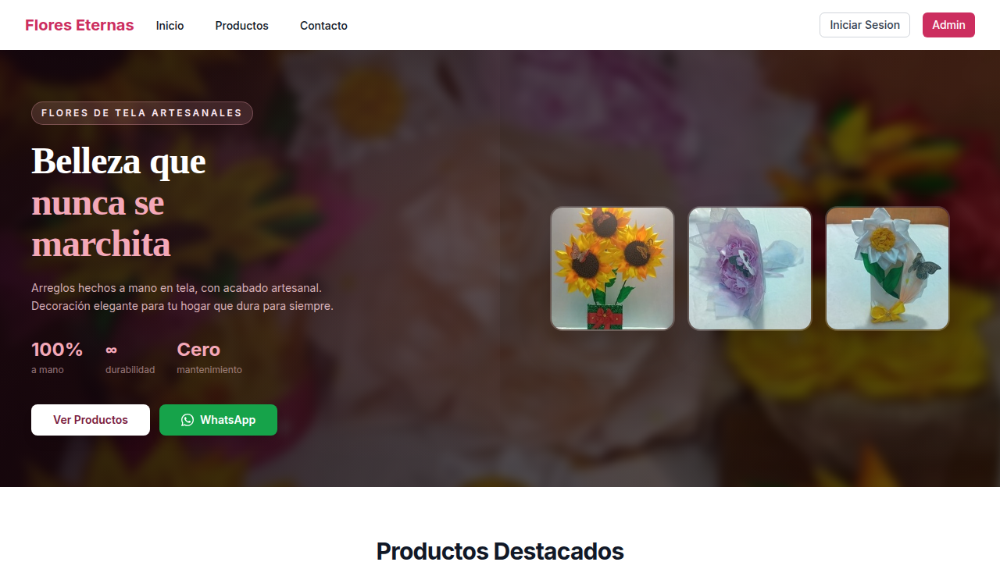</a>
      <br/><b>Flores Eternas</b>
      <br/><sub>E-commerce con integración al SRI de Ecuador: XML de factura, clave de acceso y envío SOAP.</sub>
      <br/><sub><code>Node.js</code> <code>Prisma</code> <code>PostgreSQL</code></sub>
    </td>
    <td align="center" width="33%">
      <a href="https://mickaell.novamicktools.com/proyectos/mcp-context-server">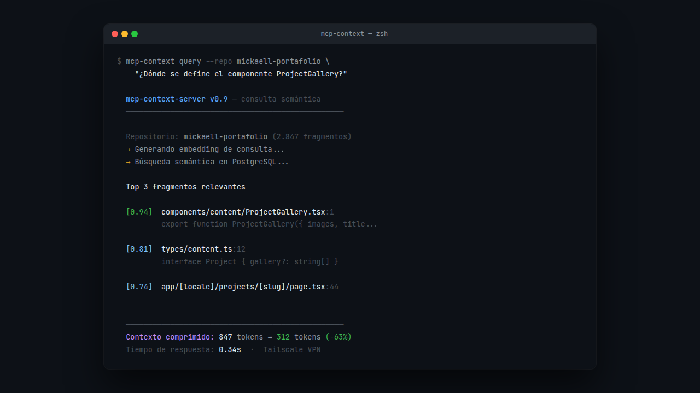</a>
      <br/><b>mcp-context-server</b>
      <br/><sub>Servidor MCP que indexa repos y los consulta con IA usando contexto comprimido.</sub>
      <br/><sub><code>Python</code> <code>PostgreSQL</code> <code>DeepSeek</code></sub>
    </td>
  </tr>
</table>

Además: **Facilito** (SaaS multitenancy con chat IA), **Facturador**, **MotoVox** (intercom P2P para moto con Flutter + C vía FFI), **NovaMickTools**, **SimuladorPreguntas** y **TallerApp**. Todos están en [mickaell.novamicktools.com/proyectos](https://mickaell.novamicktools.com/proyectos).

---

## Características

- **Bilingüe de verdad.** UI, contenido, metadata y CV en español e inglés, con rutas localizadas y selector ES/EN.
- **Contenido como código.** Los proyectos son MDX con frontmatter y se renderizan en el servidor con `next-mdx-remote/rsc`. Si falta una traducción, se usa el español.
- **CV generado desde una sola fuente.** `lib/cv/content.ts` alimenta tanto la vista HTML como los PDF.
- **Tema claro/oscuro** con `next-themes` (oscuro por defecto).
- **SEO completo:** Open Graph y Twitter Card, OG image dinámica con `next/og`, `sitemap.xml` y `robots.txt`.
- **Estático y liviano:** las páginas se prerenderizan en build y salen en una imagen Docker `standalone`.

---

## Stack

| Capa | Tecnología |
| --- | --- |
| Framework | Next.js 16 App Router + React 19 |
| Lenguaje | TypeScript |
| Estilos | Tailwind CSS v4 + shadcn/ui |
| i18n | next-intl (español + inglés, rutas localizadas) |
| Contenido | MDX + next-mdx-remote + gray-matter |
| CV PDF | @react-pdf/renderer (un PDF por idioma) |
| Temas | next-themes |
| Deploy | Docker (multi-stage, standalone) + Railway |

---

## Desarrollo local

Requiere **Node 20**.

```bash
git clone https://github.com/Mickaell22/mickaell-portafolio.git
cd mickaell-portafolio
npm install
npm run dev
```

Abre [http://localhost:3000](http://localhost:3000).

| Script | Qué hace |
| --- | --- |
| `npm run dev` | Servidor de desarrollo |
| `npm run build` | Build de producción |
| `npm run start` | Servidor de producción |
| `npm run lint` | Linter |
| `npm run generate:cv` | Regenera `public/CV_es.pdf` y `public/CV_en.pdf` |

---

## El CV en PDF

El PDF **no se genera en runtime**. `npm run generate:cv` (`scripts/generate-cv.tsx` + `lib/cv/CvDocument.tsx`) escribe `public/CV_es.pdf` y `public/CV_en.pdf`, y `/cv` enlaza a esos archivos estáticos.

> Después de editar `lib/cv/content.ts`, corre `npm run generate:cv` y commitea los dos PDF.

El formato es Harvard, en una columna y pensado para que lo lean bien los ATS.

---

## Idiomas

El español es el idioma por defecto y usa rutas limpias. El inglés va bajo `/en`, con pathnames localizados:

| Español | Inglés |
| --- | --- |
| `/` | `/en` |
| `/proyectos` | `/en/projects` |
| `/sobre-mi` | `/en/about` |
| `/cyber` | `/en/cyber` |
| `/cv` | `/en/cv` |

- Los textos de UI viven en `messages/es.json` y `messages/en.json`.
- Los datos del *about* (bio, experiencia, educación, skills) están en `lib/content/about.ts`.
- Los proyectos MDX tienen una versión por idioma en `content/projects/{es,en}/`.

---

## Estructura

```
app/
├── [locale]/             # rutas por idioma (es | en)
│   ├── (main)/           # layout con navbar/footer
│   │   ├── page.tsx      # home
│   │   ├── projects/     # listado + detalle [slug]
│   │   ├── about/        # experiencia, educación, skills
│   │   └── cyber/        # writeups (próximamente)
│   └── cv/               # CV en pantalla (botón al PDF del idioma activo)
i18n/                     # routing, navigation y request config de next-intl
middleware.ts             # detección/redirección de idioma
components/
├── ui/                   # componentes shadcn/ui
├── layout/               # nav, footer, theme provider, language switcher
├── sections/             # hero, proyectos destacados, filtros
└── content/              # tarjeta de proyecto, mdx renderer
lib/
├── content/              # loaders de proyectos y datos del about (bilingüe)
└── cv/                   # contenido del CV (bilingüe) + documento PDF
content/
└── projects/{es,en}/     # case studies en MDX por idioma
messages/                 # traducciones de UI (es.json, en.json)
scripts/
└── generate-cv.tsx       # genera public/CV_es.pdf y public/CV_en.pdf
public/                   # assets estáticos + CV_es.pdf / CV_en.pdf
docs/screenshots/         # capturas y título animado de este README
```

---

## Deploy

Se despliega en **Railway** a partir del `Dockerfile` (`node:20-alpine`, multi-stage, output `standalone`). `railway.toml` fija `builder = "dockerfile"`.

---

## Roadmap

- [x] Sistema de contenido MDX + páginas de proyecto
- [x] About, experiencia y skills
- [x] CV en PDF descargable (formato Harvard)
- [x] SEO + Open Graph
- [x] Internacionalización ES/EN + CV bilingüe
- [x] Deploy en Railway
- [ ] Sección Cyber con writeups
- [ ] Área UX con casos de diseño

---

<div align="center">

**¿Tienes un proyecto en mente?** [Escríbeme](mailto:mickaelmoranvera03@gmail.com) o mira el sitio en [mickaell.novamicktools.com](https://mickaell.novamicktools.com)

<sub>Mickaell Morán · Guayaquil, Ecuador</sub>

</div>
